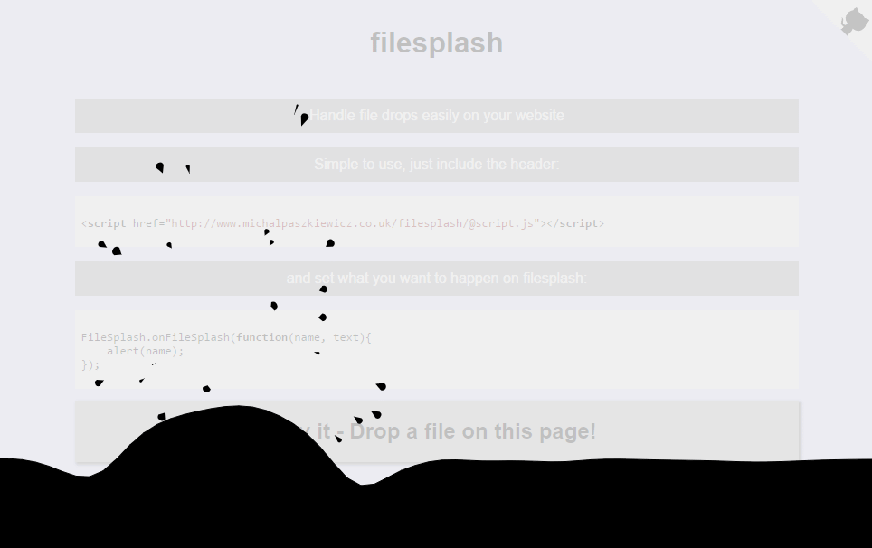

[](http://www.michalpaszkiewicz.co.uk/filesplash/)

filesplash
------------------------

Handle file drops easily on your website

Simple to use, just include the header:

```html
<script href="http://www.michalpaszkiewicz.co.uk/filesplash/@script.js"></script>
```

and set what you want to happen on filesplash:

```js
FileSplash.onFileSplash(function(name, text){
    alert(name);
});
```

Try it out:

http://www.michalpaszkiewicz.co.uk/filesplash/